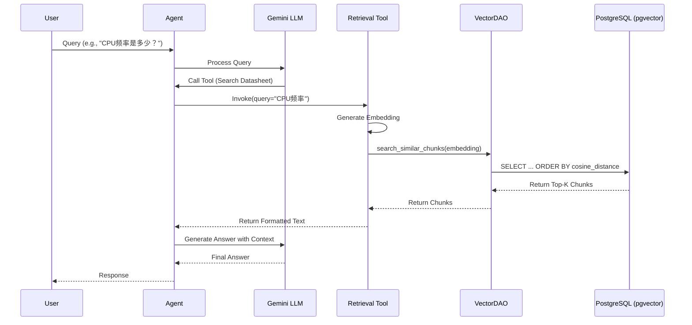

# LangChain Agent Development Plan: VisionFive 2 Datasheet Query

## 1. Objective
Develop a LangChain-based Agent capable of answering user queries about the "VisionFive 2 Datasheet" (PDF) by retrieving relevant content from the existing PostgreSQL vector database using semantic search.

## 2. System Architecture

### 2.0 Workflow Diagram

### 2.1 Database Layer (Existing)
*   **Table**: `document_chunks_gemini`
*   **Columns**: `content`, `embedding` (768-dim), `metadata` (contains `page_number`), `document_id`.
*   **Index**: HNSW on embedding column for cosine similarity.

### 2.2 Data Access Layer (To Be Updated)
*   **Component**: `src/services/vector_dao.py` (VectorDAO)
*   **Requirement**: Add a `search_similarity` method to execute vector similarity queries using SQLAlchemy and `pgvector` operators (e.g., `<=>` or cosine distance).

### 2.3 Retrieval Service (To Be Created)
*   **Component**: `src/services/retrieval_service.py` (New or update existing)
*   **Function**: 
    1.  Accept query text.
    2.  **Generate Embedding**: Use `GoogleGenerativeAIEmbeddings` (model="models/embedding-001") to convert the natural language query into a vector. **Note**: This is a critical step because the database performs similarity search on vectors, not raw text.
    3.  Call `VectorDAO` to get top-k relevant chunks.
    4.  Format the chunks into a context string.

### 2.4 Agent Layer (To Be Created)
*   **Component**: `src/examples/agent_query_demo.py` (New)
*   **Tool**: `RetrieverTool` wrapping the retrieval service.
*   **LLM**: Gemini (via `src/llm/gemini_chat_model.py`).
*   **Design**: Use LangChain's Tool calling or ReAct pattern to allow the LLM to decide when to search the datasheet.

## 3. Implementation Steps

### Step 1: Enhance VectorDAO
*   **File**: `src/dao/vector_dao.py`
*   **Task**: Implement `search_similar_chunks(query_embedding: List[float], limit: int = 5) -> List[DocumentChunkGemini]`.
*   **Details**: Use `order_by(DocumentChunkGemini.embedding.cosine_distance(query_embedding))`.
    *   **SQL Equivalence**: `ORDER BY embedding <=> query_vector`
    *   **Operator**: `<=>` (Cosine Distance) provided by `pgvector`.
    *   **Note**: SQLAlchemy has no built-in support for vector operations. We rely on the `pgvector-python` library to extend SQLAlchemy to support non-standard SQL operators like `<=>` used by the `pgvector` PostgreSQL extension.

### Step 2: Implement Retrieval Tool
*   **File**: `src/tools/datasheet_tool.py` (New)
*   **Task**: Create a LangChain `Tool` or function.
*   **Logic**:
    *   Input: `query: str`
    *   Process: Embed query -> DAO Search -> Return formatted text (content + page numbers).

### Step 3: Create Agent Script
*   **File**: `src/examples/agent_query_demo.py`
*   **Task**:
    1.  Initialize `VectorDAO` and `AsyncSession`.
    2.  Initialize `GoogleGenerativeAIEmbeddings`.
    3.  Define the Tool.
    4.  Initialize Gemini LLM (`ChatGoogleGenerativeAI`).
    5.  Create Agent (e.g., `create_react_agent` or `create_tool_calling_agent`).
    6.  Execute a test query: "VisionFive 2 的主要特性有哪些？" (Query in Chinese matching the PDF content)

## 4. Testing Plan
1.  **Unit Test DAO**: Verify `search_similar_chunks` returns results for a known vector.
2.  **Integration Test**: Run the agent script with specific questions about the datasheet (e.g., "CPU频率是多少？", "内存接口参数").
3.  **Verification**: Check if the response cites correct technical details matching the PDF content.

## 5. Prerequisites
*   Environment variables: `GOOGLE_API_KEY` (for embeddings and LLM).
*   Database connection: Correctly configured in `src/configs/db.py`.
