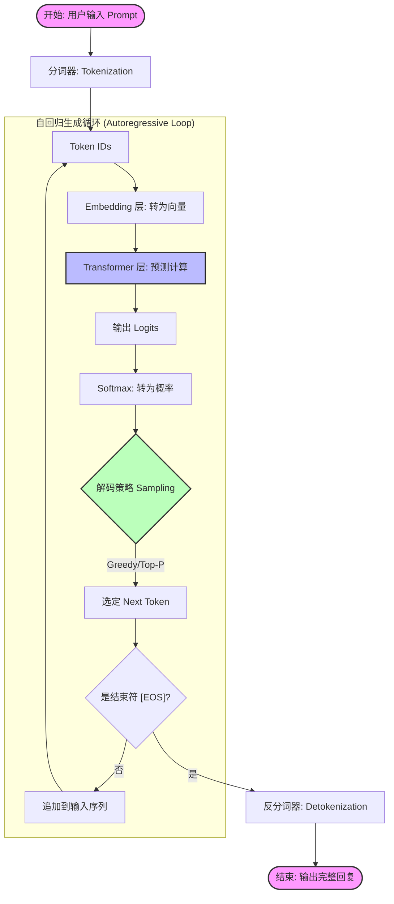

# LLM 文本生成原理详解：从输入到输出

本文档详细描述了大型语言模型（LLM）生成文本的核心步骤与原理。LLM 的生成本质上是一个**自回归（Autoregressive）**的过程，即“预测下一个 Token”。

## 核心流程概述

LLM 生成文本的过程可以概括为三个主要阶段的循环：
1.  **编码 (Encoding)**：将人类语言转换为机器可理解的数值向量。
2.  **预测 (Prediction)**：模型根据上下文计算下一个 Token 的概率分布。
3.  **解码 (Decoding)**：根据概率分布选择下一个 Token 并转换回文本。

这个过程会不断重复，直到生成结束符。

## 详细步骤

### 1. 输入处理 (Input Processing)

在模型真正开始“思考”之前，需要对输入进行预处理。

*   **分词 (Tokenization)**:
    *   将输入的 Prompt（提示词）切分成最小语义单元，称为 **Token**。
    *   Token 可以是单词、子词（subword）或字符。
    *   例如："我爱AI" -> `["我", "爱", "AI"]` -> `[101, 2345, 8901]` (Token IDs)。
*   **Embedding (嵌入)**:
    *   将 Token ID 转换为高维向量（Vector）。
    *   这个向量捕捉了词义、位置等信息。

### 2. 模型推理 (Model Inference / Prediction)

这是模型的“大脑”运作部分，通常基于 Transformer 架构。

*   **自注意力机制 (Self-Attention)**:
    *   模型分析输入序列中各个 Token 之间的关系（例如，代词“它”指代前面的哪个名词）。
*   **前馈网络 (Feed-Forward Networks)**:
    *   处理和整合信息。
*   **输出 Logits**:
    *   经过多层计算后，模型在最后一层输出一个 **Logits** 向量。
    *   Logits 的维度等于词表大小（Vocabulary Size）。向量中的每个数值代表对应 Token 成为“下一个词”的原始得分。

### 3. 输出解码 (Output Decoding)

将模型的原始输出转换为确定的 Token。

*   **Softmax**:
    *   将 Logits 转换为**概率分布**（所有概率之和为 1）。
*   **采样策略 (Sampling Strategy)**:
    *   根据概率分布选择最终的 Token。
    *   **Greedy Search (贪婪搜索)**: 总是选择概率最高的词（`Temperature = 0`）。
    *   **Top-K / Top-P (Nucleus Sampling)**: 从概率最高的前 K 个或累积概率为 P 的集合中随机采样，增加生成的多样性和创造力（`Temperature > 0`）。
*   **Detokenization (反分词)**:
    *   将选定的 Token ID 转换回人类可读的文本字符。

### 4. 自回归循环 (The Autoregressive Loop)

*   **追加输入 (Append)**: 将刚刚生成的 Token 添加到输入序列的末尾。
*   **循环**: 将新的完整序列作为输入，再次执行上述步骤，预测再下一个 Token。
*   **终止**: 当模型生成特殊的 **[EOS]** (End of Sequence) Token 或达到最大长度限制时，生成停止。

---

## 流程图 (Mermaid Flowchart)

以下流程图展示了从输入 Prompt 到生成完整回复的循环过程。

## 关键概念总结

| 步骤 | 输入 | 输出 | 核心作用 |
| :--- | :--- | :--- | :--- |
| **Tokenization** | 文本字符串 | Token IDs (数字列表) | 将人类语言转化为机器可读的索引 |
| **Inference** | Token IDs | Logits (概率得分) | 根据上下文预测下一个词的可能性 |
| **Sampling** | Logits | 单个 Token ID | 决定最终选择哪个词（引入随机性） |
| **Loop** | 新 Token | 下一轮预测 | 逐词构建完整句子 |
