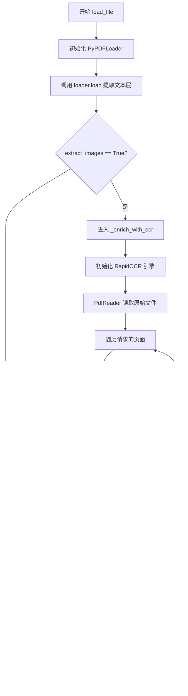

# PDFLoader 中的 OCR 文字提取实现详解

本文档详细介绍了我们如何在 `src/loaders/pdf_loader.py` 中通过集成 `rapidocr-onnxruntime` 实现了对 PDF 图像内容的文字提取（OCR）。

---

## 1. 背景与动机

默认的 `langchain_community.document_loaders.PyPDFLoader` 虽然支持 `extract_images` 参数，但在某些场景下，它并不会自动将 OCR 识别后的文字合并到 `page_content` 中。为了确保能够百分之百提取出 PDF 页面中嵌入的图像文字（如电路图标签、截图文字等），我们采用了 **Mix-in (混合)** 模式：在保留原生文本层提取能力的同时，手动插入自定义的 OCR 处理流程。

---

## 2. 核心技术栈

*   **pypdf**: 用于底层的 PDF 页面解析和原始图片对象提取。
*   **rapidocr-onnxruntime**: 核心 OCR 引擎。
    *   *优势*：基于 ONNX Runtime，运行速度快，且**不需要安装 Tesseract 等系统级组件**，完全通过 Python 包分发。
*   **Pillow (PIL)**: 用于处理从 PDF 中提取出的二进制图片数据。

---

## 3. 逻辑流程图 (Mermaid)



---

## 4. 代码深度讲解

### 4.1 `load_file` 方法：逻辑枢纽

`load_file` 是外部调用的主入口，它负责协调文本提取和 OCR 增强。

```python
    def load_file(self, source: str, **kwargs) -> Document:
        # ... 略过参数获取和日志打印
        
        # 1. 初始化 LangChain 的 PyPDFLoader
        loader = PyPDFLoader(
            file_path=source,
            extract_images=extract_images, # 告诉底层库我们要处理图像
            password=password
        )
        
        # 2. 提取文本层 (Native Text Layer)
        # 这一步会利用 pypdf 提取 PDF 中原本就是文本的内容，返回一个 List[Document]
        documents = loader.load()
        
        # 3. 页面过滤
        # 如果用户指定了特定页面（如 pages=[10]），我们在这里进行筛选
        if pages:
            filtered_docs = []
            for page_num in pages:
                idx = page_num - 1
                if 0 <= idx < len(documents):
                    filtered_docs.append(documents[idx])
            documents = filtered_docs
        
        # 4. 【关键步骤】OCR 文本增强
        # 如果 extract_images 为 True，则进入我们自定义的 OCR 流程
        if extract_images:
            self._enrich_with_ocr(documents, source, pages)

        # 5. 内容合并
        # 将处理后的各页内容用 "--- Page Break ---" 标记拼接成一个完整的字符串
        combined_content = "\n\n--- Page Break ---\n\n".join(
            doc.page_content for doc in documents
        )
        
        # 6. 返回结果
        # 返回一个包含完整文本和元数据的 Document 对象
        return Document(page_content=combined_content, metadata=metadata)
```

---

### 4.2 `_enrich_with_ocr` 方法：技术核心

该方法负责底层的图像提取和 OCR 识别。

#### A. 引擎延迟加载
```python
        try:
            from rapidocr_onnxruntime import RapidOCR
            ocr_engine = RapidOCR()
        except ImportError:
            # 如果没装包，优雅降级，打印警告
            logger.warning("rapidocr-onnxruntime not installed. Skipping OCR for images.")
            return
```
**讲解：** 我们没有在文件顶部全局导入 RapidOCR，而是放在方法内部。这样如果用户不需要 OCR 功能，就不必承担加载庞大 OCR 模型的时间和内存开销。

#### B. 页面索引映射
```python
            reader = pypdf.PdfReader(source) # 使用原生 pypdf 读取
            
            # 如果指定了 [1, 3] 页，doc_page_indices 会变成 [0, 2]
            if requested_pages:
                doc_page_indices = [p - 1 for p in requested_pages]
            else:
                doc_page_indices = list(range(len(documents)))
```
**讲解：** 这是一个坑点。`documents` 列表的长度取决于你加载了多少页。如果只加载了第 10 页，`documents` 长度就是 1，索引是 0。但我们需要告诉 `pypdf` 去读取原文件的第 9 个索引。这段逻辑保证了“索引对位”。

#### C. 图片提取与 OCR
```python
            for i, page_idx in enumerate(doc_page_indices):
                page = reader.pages[page_idx]
                images = page.images # 获取页面所有图片对象
                
                ocr_texts = []
                for image in images:
                    # image.data 直接拿到图片的 Bytes 数据
                    result, _ = ocr_engine(image.data)
                    if result:
                        # RapidOCR 返回结果格式：[[[box], text, score], ...]
                        # 我们通过列表推导式 line[1] 拿到纯文字部分
                        text = "\n".join([line[1] for line in result])
                        if text.strip():
                            # 包装识别出的文字，打上标签
                            ocr_texts.append(f"[Image Text]:\n{text}")
```
**讲解：**
*   我们利用了 `pypdf` 6.x 版本的新特性，可以直接通过 `page.images` 访问图片。
*   `image.data` 是内存中的字节流，避免了 IO 读写临时文件的损耗。
*   `ocr_engine(image.data)` 是最核心的识别动作。

#### D. 就地修改（In-place Update）
```python
                if ocr_texts:
                    # 将识别到的文字追加到对应 Document 对象的原有文本后面
                    documents[i].page_content += "\n\n" + "\n\n".join(ocr_texts)
```
**讲解：** 这种设计模式不会创建新的 Document 对象，而是直接修改传入的列表对象，节省了内存空间。

---

## 5. 完整代码参考

以下是 `src/loaders/pdf_loader.py` 中关键方法的完整实现：

### 5.1 `load_file` 方法

```python
    def load_file(self, source: str, **kwargs) -> Document:
        try:
            extract_images = kwargs.get('extract_images', False)
            pages = kwargs.get('pages', None)
            password = kwargs.get('password', None)
            
            logger.info(f"Loading PDF: {source}")
            
            loader = PyPDFLoader(
                file_path=source,
                extract_images=extract_images,
                password=password
            )
            
            documents = loader.load()
            
            if not documents:
                raise ValidationError(message="PDF is empty", error_code="EMPTY_PDF", source=source)

            if pages:
                filtered_docs = []
                for page_num in pages:
                    idx = page_num - 1
                    if 0 <= idx < len(documents):
                        filtered_docs.append(documents[idx])
                documents = filtered_docs

            if extract_images:
                self._enrich_with_ocr(documents, source, pages)

            combined_content = "\n\n--- Page Break ---\n\n".join(
                doc.page_content for doc in documents
            )
            
            metadata = documents[0].metadata.copy() if documents else {}
            metadata.update({
                'source': source,
                'file_type': 'pdf',
                'total_pages': len(documents),
                'file_size': Path(source).stat().st_size
            })
            
            return Document(page_content=combined_content, metadata=metadata)
                
        except Exception as e:
            raise ValidationError(message=str(e), error_code="PDF_LOAD_ERROR", source=source) from e
```

---

## 6. 测试验证

为了验证 OCR 功能，我们编写了专门的测试用例来检查第 10 页（包含产品框图）的内容提取情况。

### 6.1 测试代码 (`test/loaders/test_pdf_loader.py`)

```python
    def test_load_file_with_images(self, loader):
        """Test loading file with image extraction enabled."""
        PAGE_NUM = 10
        document = loader.load_file(PDF_PATH, extract_images=True, pages=[PAGE_NUM])
        
        assert len(document.page_content) > 0
        print(f"\n=== Page {PAGE_NUM} Content (Image Extraction Enabled) ===")
        print(document.page_content)
```

### 6.2 测试输出结果

```text
2025-12-28 01:29:06.981 | DEBUG    | src.loaders.pdf_loader:_enrich_with_ocr:162 - Added OCR text from 6 images to page 10

=== Page 10 Content (Image Extraction Enabled) ===
| 1 - 产品介绍
图  1-1 昉·星光 2  产品框图（顶部视图）
... (原生文本) ...
[Image Text]:
StarFive
VisionFive 2
AE
888
...
```

---

## 7. 实现的优势

1.  **零系统依赖**：完全通过 Python 包实现 OCR。
2.  **强制增强**：弥补了 `PyPDFLoader` 默认对图片文字提取不力的问题。
3.  **精准映射**：支持特定页面的 OCR 提取。

---

## 8. 依赖说明 (requirements.txt)

```text
pypdf==6.5.0
Pillow==12.0.0
rapidocr-onnxruntime==1.4.4
```
