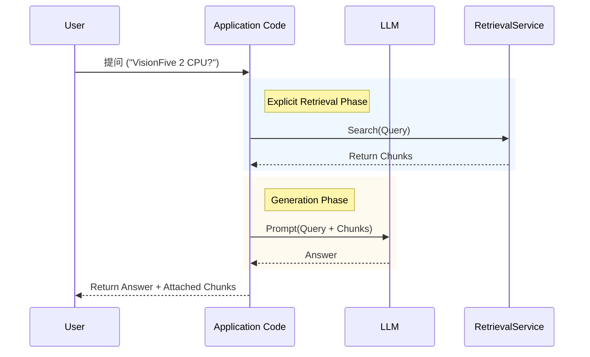
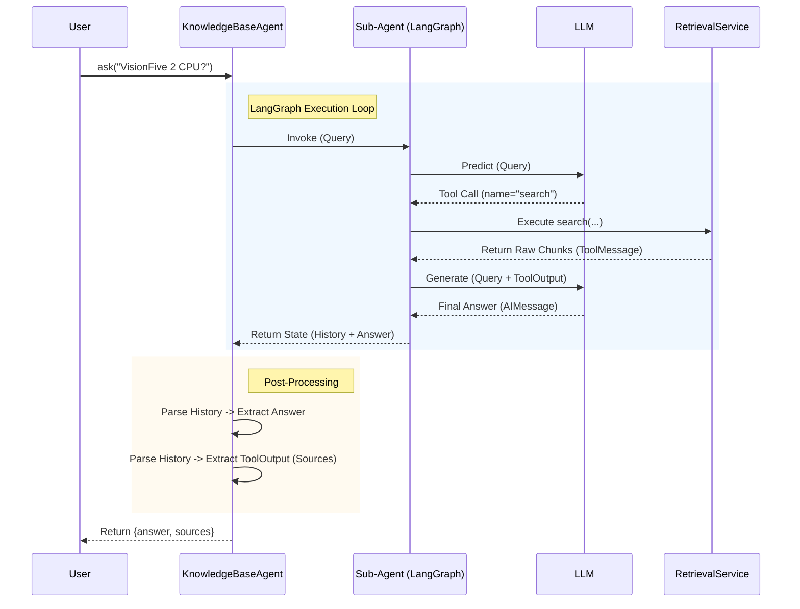

# RAG Agent 响应策略：文档与分析

## 1. 简介

在构建基于 RAG (Retrieval-Augmented Generation) 的问答系统时，如何准确、可信地向用户展示检索到的源文档（Source Chunks）是一个关键问题。

本文档对比了两种主要的技术方案：**Explicit Retrieval (RAG Chain)** 和 **Tool Calling Agent**，并详细解析了本项目最终采用的方案（方案 2），以及其在代码层面的具体实现。

## 2. 方案对比

### 方案 1：显式检索 (Explicit Retrieval / RAG Chain)

**流程**：
1.  **Code**: 接收用户 Query。
2.  **Code**: 调用 Retrieval Service 获取 Top K Chunks。
3.  **Code**: 将 Query + Chunks 组装成 Prompt。
4.  **LLM**: 根据 Prompt 生成 Answer。
5.  **Code**: 将 `Answer` + `Chunks` 拼接返回给用户。

#### 流程图 (Scenario 1)



**优缺点**：
*   **优点**：实现简单，无幻觉（Sources 是代码直接附加的）。
*   **缺点**：**缺乏灵活性**。无论用户问什么（即使是闲聊），都会先去数据库检索，造成资源浪费。无法进行多步推理或根据上下文决定是否检索。

---

### 方案 2：工具调用代理 (Tool Calling Agent) - **本项目采用**

本方案包含三层架构细节：
*   **KnowledgeBaseAgent (Wrapper)**: 应用程序层面的封装，负责后处理和结果组装。
*   **Sub-Agent (LangGraph Runtime)**: 智能体编排引擎，负责状态管理和工具路由。
*   **LLM (Model)**: 负责推理和生成。

**流程**：
1.  **Wrapper**: 接收用户 Query，启动 Sub-Agent。
2.  **Sub-Agent** -> **LLM**: 发送 Query，请求决策。
3.  **LLM** -> **Sub-Agent**: 返回 Tool Call Request (如 "search").
4.  **Sub-Agent** -> **Tool**: 执行 `RetrievalService`。
5.  **Tool** -> **Sub-Agent**: 返回 `ToolOutput` (Raw Chunks)。
6.  **Sub-Agent** -> **LLM**: 发送 `ToolOutput` 作为上下文。
7.  **LLM** -> **Sub-Agent**: 返回最终 Answer。
8.  **Sub-Agent** -> **Wrapper**: 返回完整状态（包含所有历史消息）。
9.  **Wrapper**: 解析历史消息，提取 Chunks 和 Answer，组装返回给用户。

#### 流程图 (Scenario 2)



**优缺点**：
*   **优点**：
    *   **无幻觉**：Sources 同样是从工具执行结果中代码提取的，保证真实。
    *   **智能决策**：Agent 可以根据问题判断是否需要检索，以及如何检索（例如提取 Topic 参数）。
    *   **多步推理**：Agent 可以根据第一次检索结果决定是否需要再次检索。
*   **缺点**：实现较复杂，需要解析 Message History。

---

## 3. 最终选择与实现 (方案 2)

本项目选择了 **方案 2**，以确保引用的准确性同时保留 Agent 的智能特性。

### 3.1 代码结构

核心逻辑位于 `src/agents/knowledge_base_agent.py` 类中。

*   **`create_agent`**: 构建 LangChain Graph，负责编排 LLM 和 Tool 的交互。
*   **`ask`**: 执行 Graph，并负责**后处理**（提取结果）。

### 3.2 详细代码解析

#### Tool 返回的数据 (RetrievalService)
首先，`src/services/retrieval_service.py` 负责生成 Tool 的输出字符串。这个字符串包含了 Chunk 的元数据和内容。

```python
# src/services/retrieval_service.py

# 格式化 Header，包含 Score 和 Metadata
header = f"[Source {i+1}]{page_info} (Score: {distance:.4f}){status_tag}"

# 拼接 Header 和 Content
context_parts.append(f"{header}:\n{chunk.content}")
```

#### Agent 执行与解析 (KnowledgeBaseAgent)

在 `src/agents/knowledge_base_agent.py` 的 `ask` 方法中：

```python
    async def ask(self, query: str, topic: Optional[str] = None) -> Dict[str, Any]:
        # ... (构建输入) ...
        
        # 1. 执行 Agent Graph
        # result["messages"] 包含了完整的对话历史，包括：
        # HumanMessage -> AIMessage (ToolCall) -> ToolMessage (Output) -> AIMessage (Final Answer)
        result = await self.agent_graph.ainvoke(inputs)
        messages = result["messages"]
        
        # 2. 提取 LLM 的回答 (Answer)
        # 通常是列表中的最后一条消息
        last_message = messages[-1]
        answer_text = str(last_message.content)
        
        # 3. 提取 Tool 的输出 (Sources)
        sources = []
        for msg in messages:
            # 遍历历史消息，寻找 ToolMessage
            if isinstance(msg, ToolMessage) and msg.name == "search_knowledge_base":
                tool_output = str(msg.content)
                
                # 4. 解析 Tool Output 字符串
                # 我们的 RetrievalService 返回格式是：
                # [Source 1] ... :
                # Content ...
                
                current_source = None
                current_content = []
                
                lines = tool_output.split('\n')
                for line in lines:
                    stripped_line = line.strip()
                    if stripped_line.startswith("[Source"):
                        # 保存上一个 Source
                        if current_source:
                            full_content = ' '.join(current_content)
                            # 保存完整内容
                            sources.append(f"{current_source}\nContent: {full_content}")
                        
                        # 开始新 Source
                        current_source = stripped_line.rstrip(':')
                        current_content = []
                    elif current_source is not None:
                        if stripped_line:
                            current_content.append(stripped_line)
                
                # 保存最后一个 Source
                if current_source:
                     full_content = ' '.join(current_content)
                     sources.append(f"{current_source}\nContent: {full_content}")
                        
        # 5. 组装最终结果
        return {
            "answer": answer_text,
            "sources": sources
        }
```

### 3.3 关键点总结

1.  **为什么 ToolMessage 绝对可靠？**
    *   **框架保证**：`ToolMessage` 的生成和格式不是由 LLM 决定的，而是由 LangChain/LangGraph 框架代码控制的。
    *   **流程**：
        1.  LLM 输出结构化的 **Tool Call Request** (如 `search(query="...")`)。
        2.  框架捕获请求，执行 Python 函数 (`RetrievalService.search_knowledge_base`)。
        3.  框架将 Python 函数的返回值（字符串）强制封装为 `ToolMessage` 对象。
        4.  框架将此对象追加到消息历史。
    *   **结论**：因为这是确定性的程序逻辑，不存在 LLM 的“幻觉”或“格式错误”问题。只要工具执行了，`ToolMessage` 就一定存在且内容准确。

2.  **手动解析**：我们编写了 Python 代码来解析 `ToolMessage.content`。这让我们能够完全控制如何向用户展示来源（例如，我们选择了截断内容以保持界面整洁，但 LLM 看到的是全文）。
3.  **可靠性**：即使用户问了一个无关问题，导致 LLM 拒绝回答，`ToolMessage` 依然存在（只要搜索被执行了）。这让我们能够展示“虽然没回答，但我确实搜到了这些东西”。
