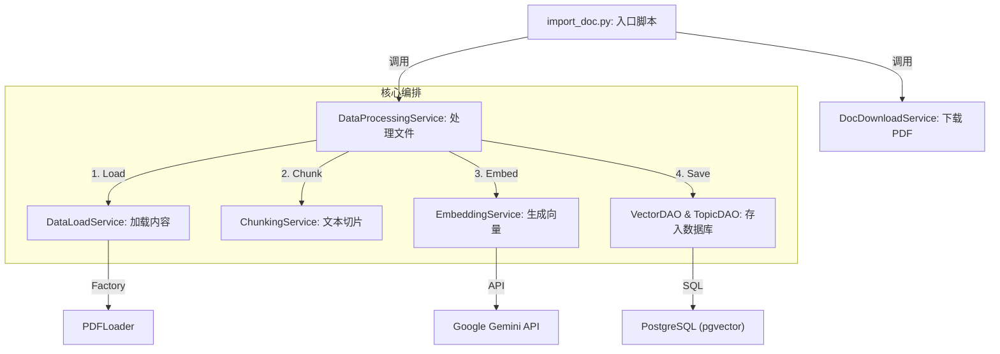
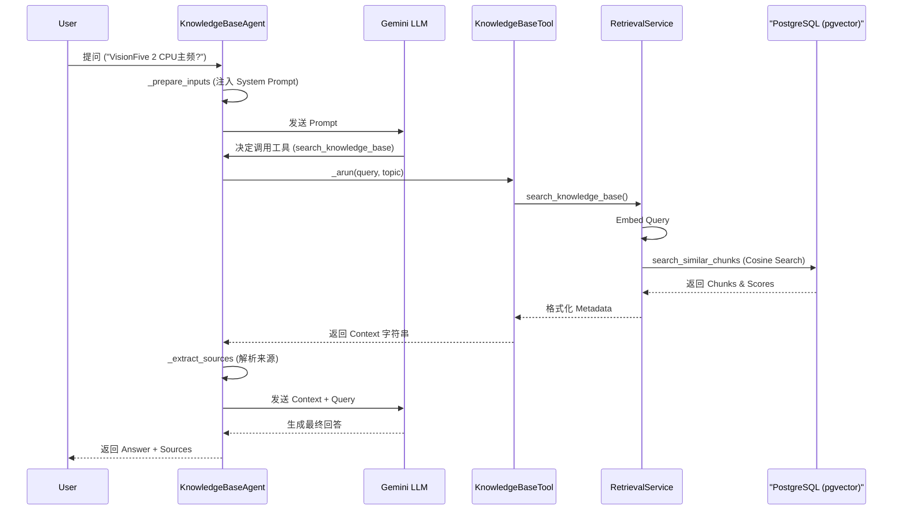

# 基于 LangChain + Gemini + CloudSQL (pgvector) 的 RAG 实现指南

本文档详细描述了本项目如何基于 **LangChain** (应用框架), **Google Gemini** (LLM & Embedding), 以及 **CloudSQL PostgreSQL** (配合 `pgvector` 插件) 实现一个完整的 RAG (检索增强生成) 系统。

---

## 1. 数据库准备和表设计 (Database Preparation)

本项目的数据库设计采用了规范化的结构，支持文档元数据管理、多主题分类以及向量存储。

### 1.1 核心表结构

我们使用了 PostgreSQL 的 `pgvector` 扩展来存储和查询高维向量。

*   **topics**: 存储知识库的主题分类 (如 "VisionFive 2", "Linux Kernel")。
*   **documents**: 存储原始文档的元数据 (标题, 路径, 创建者)。
*   **document_topics**: 多对多关联表，将文档与主题关联。
*   **document_chunks_gemini**: 存储文档被切分后的文本片段及其对应的 Embedding 向量。

### 1.2 核心代码：表模型定义

`Document` 表存储文档的基本信息，而 `DocumentChunkGemini` 表存储切片数据。特别注意 `embedding` 字段使用了 `Vector(768)` 类型，对应 Google Gemini `text-embedding-004` 模型的维度。

```python
# src/models/document_model.py

class Document(Base):
    __tablename__ = "documents"
    id: Mapped[uuid.UUID] = mapped_column(UUID(as_uuid=True), primary_key=True, default=uuid.uuid4)
    file_path: Mapped[str] = mapped_column(String(1024), nullable=False)
    title: Mapped[Optional[str]] = mapped_column(String(255))
    creator_user_id: Mapped[Optional[int]] = mapped_column(Integer)

class DocumentChunkGemini(Base):
    __tablename__ = "document_chunks_gemini"
    id: Mapped[uuid.UUID] = mapped_column(UUID(as_uuid=True), primary_key=True, default=uuid.uuid4)
    document_id: Mapped[uuid.UUID] = mapped_column(UUID(as_uuid=True), nullable=False, index=True) 
    content: Mapped[str] = mapped_column(Text, nullable=False)
    
    # 核心：存储 768 维向量
    embedding: Mapped[Optional[List[float]]] = mapped_column(Vector(768)) 
    
    chunk_index: Mapped[int] = mapped_column(Integer, nullable=False)
    # 使用 JSONB 存储灵活的元数据 (如页码)
    meta_data: Mapped[Optional[dict]] = mapped_column("metadata", JSONB, default={}) 
```

---

## 2. Knowledge Base 数据准备 (Data Ingestion)

**知识库数据来源**:
*   **文档名称**: VisionFive 2 数据手册
*   **下载链接**: [https://doc.rvspace.org/VisionFive2/PDF/VisionFive2_DS.pdf](https://doc.rvspace.org/VisionFive2/PDF/VisionFive2_DS.pdf)

该阶段负责将原始文档 (如 PDF) 转化为数据库中的向量数据。

### 2.1 流程图 (Flowchart)



### 2.2 核心模块详解 (Modules Detail)

#### 1. 入口脚本 (`src/examples/import_doc.py`)
**功能**: 演示数据导入的全流程，包括下载文件、清理旧数据、调用处理服务。

```python
# src/examples/import_doc.py
async def main():
    # 1. 下载文件
    doc_service = DocDownloadService()
    file_path = doc_service.download('https://.../VisionFive2_DS.pdf', overwrite=True)
    
    async with AsyncSessionFactory() as session:
        # 2. 清理数据库 (仅用于演示)
        await clean_database(session)
        
        # 3. 处理文件并关联 Topic
        data_processing_service = DataProcessingService(session)
        await data_processing_service.process_file(
            file_path=file_path, 
            topic_name="开发板", 
            creator_user_id=-1
        )
```

#### 2. 下载服务 (`src/services/doc_download_service.py`)
**功能**: 负责从 URL 下载文件并保存到本地指定目录。

```python
# src/services/doc_download_service.py
class DocDownloadService(BaseModel):
    @computed_field
    @property
    def targetpath(self) -> str:
        # 动态计算存储路径
        return os.path.join(project_path, "rag_docs")

    def download(self, doc_url: str, ...) -> str:
        # 校验 URL 和文件名
        # ...
        # 使用 urlopen 下载文件流并写入本地
        with urlopen(doc_url) as response:
            with open(target_file, 'wb') as f:
                # 分块写入
                while True:
                    chunk = response.read(chunk_size)
                    # ...
        return str(target_file)
```

#### 3. 数据处理服务 (`src/services/data_processing_service.py`)
**功能**: 核心编排器 (Orchestrator)，串联加载、切片、Embedding 和存储四个步骤。

```python
# src/services/data_processing_service.py
class DataProcessingService:
    async def process_file(self, file_path: str, topic_name: str, ...):
        # 1. Load
        loaded_docs = self.data_load_service.load(file_path)

        # 2. Chunk
        chunk_texts = []
        for doc in loaded_docs:
            chunks = self.chunking_service.chunk_document(doc)
            chunk_texts.extend(chunks)

        # 3. Embed (调用 Gemini 生成向量)
        embeddings = self.embedding_service.generate_embeddings(chunk_texts)

        # 4. Save
        # 4.1 获取或创建 Topic
        topic = await self.topic_dao.get_topic_by_name(topic_name)
        if not topic:
             topic = await self.topic_dao.create_topic(...)
        
        # 4.2 创建 Document 和 Chunks
        db_document = await self.vector_dao.create_document(...)
        await self.vector_dao.add_chunks(db_document.id, chunks_data)
```

#### 4. 加载服务 (`src/services/data_load_service.py`)
**功能**: 根据文件后缀选择合适的加载器 (Loader) 并读取内容。

```python
# src/services/data_load_service.py
class DataLoadService(BaseModel):
    def load(self, filepath: str) -> list[Document]:
        # 使用工厂模式根据扩展名 (.pdf, .txt) 获取 Loader
        loader = LoaderFactory.get_loader(filepath)
        return loader.load(filepath)
```

#### 4.1 PDF 加载器 (`src/loaders/pdf_loader.py`)
**功能**: 专门用于处理 PDF 文件。基于 LangChain 的 `PyPDFLoader`，支持页面过滤、元数据提取，并集成了 **RapidOCR** 以提取 PDF 图像中的文本。最终将所有页面合并为一个 `Document` 对象，保留 `--- Page Break ---` 标记。

```python
# src/loaders/pdf_loader.py
class PDFLoader(BaseLoader[Document]):
    def load_file(self, source: str, **kwargs) -> list[Document]:
        # 1. 使用 LangChain PyPDFLoader 加载基础文本
        loader = PyPDFLoader(file_path=source, ...)
        documents = loader.load()
        
        # 2. (可选) OCR 增强：提取图片中的文字
        if kwargs.get('extract_images', False):
            self._enrich_with_ocr(documents, source, ...)

        # 3. 合并所有页面内容
        combined_content = "\n\n--- Page Break ---\n\n".join(
            doc.page_content for doc in documents
        )
        
        # 4. 构造统一的 Document 对象返回
        return [Document(page_content=combined_content, metadata=...)]
```

#### 5. 切片服务 (`src/services/chunking_service.py`)
**功能**: 将长文档切分为适合 Embedding 的小段落 (Chunk)，通常保留一定的重叠 (Overlap) 以保持上下文连续性。

```python
# src/services/chunking_service.py
class ChunkingService(BaseModel):
    chunk_size: int = 1000
    chunk_overlap: int = 200
    
    def chunk_document(self, document: Document) -> List[str]:
        text_splitter = RecursiveCharacterTextSplitter(
            chunk_size=self.chunk_size,
            chunk_overlap=self.chunk_overlap,
            # ...
        )
        return text_splitter.split_text(document.page_content)
```

#### 6. Embedding 服务 (`src/services/embedding_service.py`)
**功能**: 调用外部 API (Google Gemini) 将文本转化为向量。

```python
# src/services/embedding_service.py
class EmbeddingService:
    def __init__(self, ...):
        # 初始化 Google Embedding Provider
        embedding_provider = EmbeddingFactory.get_embedding_provider("google", "models/text-embedding-004")
        self.embeddings = embedding_provider.get_client()

    def generate_embeddings(self, text_chunks: list[str]) -> list[list[float]]:
        # 调用 API 批量生成向量
        return self.embeddings.embed_documents(text_chunks)
```

---

## 3. 用自然语言查询知识库 (RAG Query)

该阶段负责处理用户查询，检索相关文档，并生成回答。

### 3.1 流程图 (Flowchart)



### 3.2 核心模块详解 (Modules Detail)

#### 1. 入口脚本 (`src/examples/agent_query_demo.py`)
**功能**: 初始化数据库连接，创建 Agent 实例，并演示不同场景下的查询。

```python
# src/examples/agent_query_demo.py
async def run_agent_demo():
    async with async_session() as session:
        agent = KnowledgeBaseAgent(session)
        
        # 场景 1: 通用助手 (不指定 Topic，由 LLM 判断)
        await agent.ask("topic:开发板 ,VisionFive 2 的 CPU 主频是多少？")
        
        # 场景 2: 专家助手 (代码强制指定 Topic)
        await agent.ask("昉·星光 2 是什么公司的产品？", topic="开发板")
```

#### 2. 知识库 Agent (`src/agents/knowledge_base_agent.py`)
**功能**: 封装了 LangChain Agent 逻辑，负责 Prompt 管理、工具调用和结果解析。我们对 `ask` 方法进行了重构以优化结构。

```python
# src/agents/knowledge_base_agent.py
class KnowledgeBaseAgent:
    async def ask(self, query: str, topic: Optional[str] = None) -> Dict[str, Any]:
        # 1. 准备输入 (处理 Topic 注入)
        inputs = self._prepare_inputs(query, topic)
        
        # 2. 执行 Agent Graph
        result = await self.agent_graph.ainvoke(inputs)
        
        # 3. 提取结果和来源
        return {
            "answer": self._extract_answer(messages),
            "sources": self._extract_sources(messages) # 包含 _parse_tool_output 逻辑
        }

    def _prepare_inputs(self, query: str, topic: Optional[str]):
        messages = []
        if topic:
            # 关键：通过 SystemMessage 强制 LLM 使用特定 Topic
            instruction = f"IMPORTANT: ... use ... tool with topic='{topic}'."
            messages.append(SystemMessage(content=instruction))
        messages.append(HumanMessage(content=query))
        return {"messages": messages}
```

#### 3. 知识库工具封装 (`src/tools/knowledge_base_tool.py`)
**功能**: 将 `RetrievalService` 包装为 LangChain 可识别的 `BaseTool`，定义了输入 Schema。

```python
# src/tools/knowledge_base_tool.py
class SearchKnowledgeBaseInput(BaseModel):
    query: str = Field(description="The search query...")
    topic: Optional[str] = Field(description="Specific topic...")

class SearchKnowledgeBaseTool(BaseTool):
    def __init__(self, session: AsyncSession, **kwargs):
        self._retrieval_service = RetrievalService(session)

    async def _arun(self, query: str, topic: Optional[str] = None) -> str:
        # 代理调用 Service
        return await self._retrieval_service.search_knowledge_base(query, topic=topic)
```

#### 4. 检索服务 (`src/services/retrieval_service.py`)
**功能**: 核心检索逻辑。处理 Query Embedding，Topic 过滤，以及向量相似度搜索。

```python
# src/services/retrieval_service.py
class RetrievalService:
    async def search_knowledge_base(self, query: str, topic: Optional[str] = None):
        # 1. Query Vectorization
        query_embedding = self.embedding_client.embed_query(query)
        
        # 2. Get Filter IDs (if topic provided)
        document_ids = None
        if topic:
            document_ids = await self.topic_dao.get_document_ids_by_topic(topic)

        # 3. Vector Search (via DAO)
        chunks_with_score = await self.vector_dao.search_similar_chunks(
            query_embedding, document_ids=document_ids
        )
        
        # 4. Format Output for LLM
        # 将 Chunks 格式化为字符串，包含 Metadata 和 Score
        return formatted_context
```

#### 5. LLM 模型封装 (`src/llm/gemini_chat_model.py`)
**功能**: 继承 LangChain `BaseChatModel`，封装 Google `ChatGoogleGenerativeAI`。

```python
# src/llm/gemini_chat_model.py
class GeminiChatModel(BaseChatModel):
    def __init__(self, **kwargs):
        # 从配置读取 API Key 和 Model Name
        self.client = ChatGoogleGenerativeAI(
            model="gemini-2.5-pro",
            google_api_key=...,
            temperature=0.7,
            safety_settings=...
        )
```

#### 6. 向量数据库交互 (`src/dao/vector_dao.py`)
**功能**: 直接与 PostgreSQL 交互，执行向量相似度搜索。这是 RAG 检索的核心。

**核心代码**:
```python
# src/dao/vector_dao.py
class VectorDAO:
    async def search_similar_chunks(self, query_embedding, limit=5, document_ids=None):
        # 1. 构建距离计算表达式 (Cosine Distance)
        # pgvector 提供的 cosine_distance 方法对应 SQL 中的 <=> 操作符
        distance_col = DocumentChunkGemini.embedding.cosine_distance(query_embedding).label("distance")
        
        # 2. 构建查询语句：选择 Chunk 和 距离
        stmt = select(DocumentChunkGemini, distance_col)\
            .order_by(distance_col)\
            .limit(limit)
            
        # 3. (可选) 添加 Topic 过滤 (WHERE document_id IN (...))
        if document_ids:
            stmt = stmt.where(DocumentChunkGemini.document_id.in_(document_ids))
            
        # 执行查询
        result = await self.session.execute(stmt)
        return result.all()
```

**底层 SQL 原理**:
上述 SQLAlchemy 代码最终会被编译为类似以下的 SQL 语句，并在数据库中高效执行（利用 HNSW 索引）：

```sql
SELECT 
    id, content, embedding, ...,
    -- 计算 Query 向量与存储向量之间的余弦距离
    embedding <=> '[0.012, -0.045, ...]' AS distance
FROM 
    document_chunks_gemini
WHERE 
    document_id IN ('uuid-1', 'uuid-2', ...)  -- 如果有 Topic 过滤
ORDER BY 
    distance ASC                               -- 距离越小，相似度越高
LIMIT 5;
```
*   `<=>`: `pgvector` 扩展提供的**余弦距离**操作符。
*   `ORDER BY distance ASC`: 确保返回的是向量空间中距离 Query 最近的 Top K 个片段。

---

### 3.3 Demo 问题详细分析

#### 场景 A: General Assistant (LLM 自动推断 Topic)

**问题 1: "topic:开发板 ,VisionFive 2 的 CPU 主频是多少？"**

*   **现象**: LLM 尝试使用 topic="VisionFive 2" 检索失败，后自动回退到全局搜索。
*   **相关日志**:
    ```text
    ❓ Question: topic:开发板 ,VisionFive 2 的 CPU 主频是多少？
    ...
    INFO     | ... Filtering search by topic: VisionFive 2
    WARNING  | ... No documents found for topic 'VisionFive 2'.
    ...
    INFO     | ... No topic provided. Performing global search across all documents.
    INFO     | ... Retrieved 5 chunks (Valid by threshold: 5).
    💡 Answer: VisionFive 2搭载的CPU工作频率最高可达1.5 GHz。
    ```
*   **深度解析**: 用户输入了 "topic:开发板"，但 LLM 智能地提取了更具体的实体 "VisionFive 2" 作为 topic 参数。然而，数据库中的 Topic 名称是 "开发板"，因此第一次过滤搜索返回空。Agent (基于 LangChain 逻辑或 LLM 自我修正) 随后进行了第二次不带 Topic 的搜索，成功命中。

**问题 2: "叶丽法的胸围是多少？"**

*   **现象**: LLM 拒绝回答。
*   **相关日志**:
    ```text
    ❓ Question: 叶丽法的胸围是多少？
    💡 Answer: 我无法回答这个问题。我是一个AI助手，我的知识库主要包含技术文档和资料，不包含动漫、游戏角色的个人信息。
    ```
*   **深度解析**: 即使可能检索到了一些包含数字的片段 (噪声)，LLM 自身的安全对齐 (Safety Alignment) 和 System Prompt 设定使其识别出这是隐私问题，因此直接拒绝。注意此处没有任何检索相关的日志 (Retrieval Service)，说明 Agent 在意图识别阶段就直接决定不调用工具。

#### 场景 B: VisionFive 2 Specialist (强制指定 Topic)

**问题 3: "昉·星光 2 是什么公司的产品？"**

*   **现象**: 快速准确回答。
*   **相关日志**:
    ```text
    ❓ Question: 昉·星光 2 是什么公司的产品？
    INFO     | ... Filtering search by topic: 开发板
    INFO     | ... Retrieved 5 chunks (Valid by threshold: 5).
    💡 Answer: “昉·星光 2”是**上海赛昉科技有限公司**（StarFive）的产品。

    根据其数据手册的法律声明，该产品的版权归“上海赛昉科技有限公司”所有。
    📚 Sources: 5 found
       - [Source 1] (Page: 0, Title: 昉·星光 2数据手册, File: VisionFive2_DS.pdf) (Score: 0.4393)
    Content: 目录 表格清单...
       - [Source 2] (Page: 0, Title: 昉·星光 2数据手册, File: VisionFive2_DS.pdf) (Score: 0.4393)
    Content: 昉·星光 2数据手册 版本：1.53 日期：2023/04/28 Doc ID: VisionFive 2-DSCH-001 --- Page Break --- 法律声明 阅读本文件前的重要法律告知。 版权注释 版权 ©上海赛昉科技有限公司，2023。版权所有。 本文档中的说明均基于“视为正确”提供，可能包含部分错误。内容可能因产品开发而定期更 新或修订。上海赛昉科技有限公司  （以下简称“赛昉...
    ```
*   **深度解析**: 强制指定 `topic="开发板"`。`RetrievalService` 先获取了该 Topic 下的所有文档 ID，然后仅在这些文档中进行向量搜索。这极大缩小了搜索范围，提高了准确率和响应速度。

**问题 4: "Linux Kernel 的编译步骤？"**

*   **现象**: LLM 使用自身知识回答，而非知识库内容。
*   **相关日志**:
    ```text
    ❓ Question: Linux Kernel 的编译步骤？
    INFO     | ... Filtering search by topic: 开发板
    INFO     | ... Retrieved 5 chunks (Valid by threshold: 5).
    💡 Answer: 抱歉，我在知识库中没有找到关于 Linux Kernel 编译步骤的相关信息。知识库中的文档主要包含产品介绍、功能、接口和机械参数等内容。

    如果您想了解通用的 Linux Kernel 编译步骤...
    ```
*   **深度解析**: 知识库 (VisionFive 2 数据手册) 中没有 Linux 编译教程。向量搜索虽然返回了 Top 5 相似片段 (基于语义相似性，可能包含 "软件"、"Linux" 等词)，但相关度分数 (Score) 可能较低，且内容不包含答案。LLM 阅读 Context 后判断无法回答，于是动用了其预训练的通用知识库。

## 4. 为什么输出 Source 内容至关重要？ (Why Output Source Content?)

在构建 RAG 系统时，不仅仅要返回答案，**必须**显式返回引用的来源片段 (Source Chunks)，原因如下：

1.  **可解释性 (Explainability)**: 用户有权知道 AI 的回答是基于哪份文档、哪一页生成的，而非胡编乱造。
2.  **验证与溯源 (Verification)**: 允许用户点击链接或查看原文，验证 AI 总结是否准确。特别是在法律、医疗或技术文档场景中，原文是唯一真理。
3.  **减少幻觉 (Hallucination Reduction)**: 强迫模型基于检索到的 Context 回答，并显式引用，有助于降低模型产生幻觉的概率。
4.  **合规性 (Compliance)**: 在企业应用中，引用来源是版权和合规审计的重要要求。
